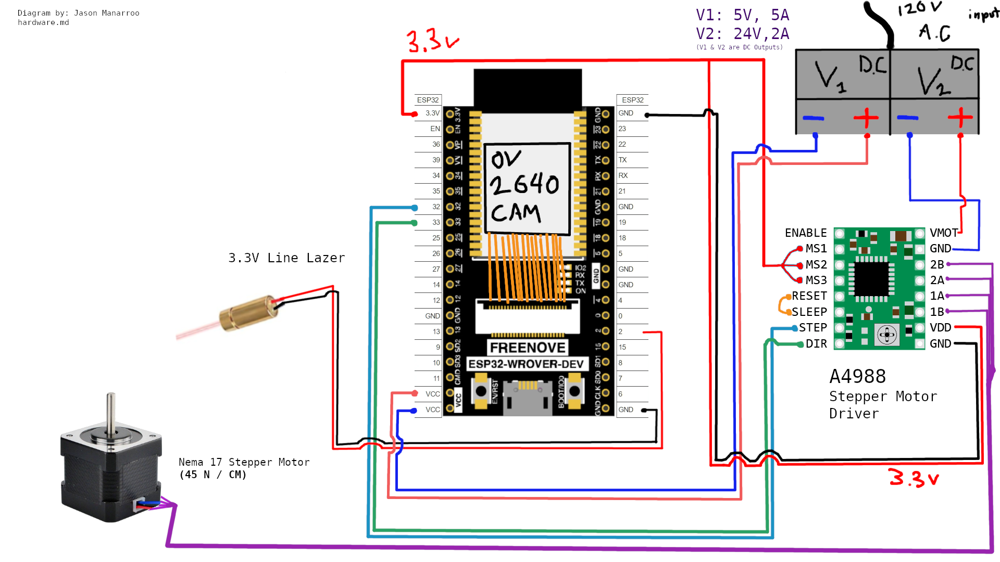

| Module / Part Name   | Link to purchase | Extra. Info (Description) | Module Voltage & Current Requirements | Extra Interface / IO info (for Module communication) |  Cost  ($CAD) |
|----------|:-------------:|:----------|:-------------|:-------------:|:-------------:|
| Freenove **ESP32-WROVER CAM** Board |  [Amazon Link](https://www.amazon.ca/dp/B09BC5CNHM?psc=1&ref=ppx_yo2ov_dt_b_product_details) | **Compatible with Arduino IDE**, Onboard   Processor: 240MHz  RAM: 8MB (SRAM)  Hard Drive: 4 MB   2.4 GHz Radio Frequency WiFi Adapter  |**Operating Voltage:**  3.3 - 5V DC **Working Current:** 150-320 mA DC  *(Depending on Mode the chip is in, E.G: Flash OFF: 180mA, Flash ON: 310mA)*| **19** Digital Pins, **3.3 V** Pin, 3x **GND** pins   Onboard Camera: **OV 2640** | $ 23.67 |
| Focusable Laser Module, Line Laser Measuring Tool *(Straight Line 650nm Red Laser)* | [Amazon Link](https://www.amazon.ca/dp/B07YWRVZX8?psc=1&ref=ppx_yo2ov_dt_b_product_details) |2.8-5V , 650nm , P = 5mW , 9 * 23mm Diode Module LASER Red | **Operating Voltage:**  2.8 - 5V DC **Working Current:**  <= 50 mA DC| N/A, only V & GND pins, this laser is either *on* or *off*. | $ 12.35 |
| **VGD-75-D524** Power Supply (2 outputs) |    [DigiKey](https://www.digikey.ca/en/products/detail/cui-inc/VGD-75-D524/11499764)   | This Power Supply transforms AC voltage into the 2 DC outputs listed in the next column, overall a good power supply that I wired up via the 3 pin plug for wall plugs. (V, Neutral, GND) |**Input:** 120 V AC   *(Canadian / NA Generic Wall Plug Voltage)*   **Output 1:** 5V DC, 5A DC   **Output 2:** 24V DC, 2A DC | This PSU got 3 pins for input [`AC(L)` , `AC(N)` & `GND`], each output has 2 pins V- & V+ (4 output pins in total) | $ 44.50 |
|Longruner A4988 Stepstick Stepper Motor Driver Module + Heat Sink (for 3D Printers)|[Amazon Link](https://www.amazon.ca/Longruner-LK02-Arduino-Professional-Mechanical/dp/B07NXP6HST/ref=cm_cr_arp_d_product_top?ie=UTF8)|I had to purchase **5x A4988 drivers** since that was the only way to get the modules with the heatsinks on Amazon, I heard these drivers tend to get fried, so it's always good to have a replacement *(the small stick-on heat sinks.)* |**Operating Voltage:**  3.3-5V (DC)   **Working Current:**  ~10mA | 2 Digital Pins   **V** & **GND** pins for motor & 4 pins connection to motor   Some Reset and extra pins |$ 18.07 |
|**NEMA 17** Stepper Motor 45Ncm (63.74oz.in)|[Amazon Link](https://www.amazon.ca/Stepper-63-74oz-42x39mm-Connector-Printer/dp/B07KZQ77VH/ref=sr_1_5?crid=81JFYM6BSLLG&keywords=Stepper+motor&qid=1662289940&sprefix=stepper+motor%2Caps%2C214&sr=8-5)| *Interacts with* A4988 Stepstick Stepper Motor Driver, this makes it easy to program stepper controls via the *ESP-32*  |**Operating Voltage:**  24V DC **Working Current:**  <= 1.5-2A DC | 4 **IO Pins** on the motor.  *(These 4 pins include **V & GND** and **2** digital pins i'm assuming)* |$ 16.94|

## Circuit Diagram & General Setup: 

This is the Circuit Diagram that connect all the modules. The **VCC** pins *(-/+)* onboard the ESP32 Step-down the 5V DC input into 3.3V *(ESP32's operating voltage)*

The 24V, 2A DC source is inputted directly into the **A4988 Stepper Driver Module** which channels it to Stepper Motor. The A4988 also runs on 3.3V logic, which is supplied by the ESP-32's 3.3V pinout. this 3.3V pinout is also connected to `MS1` , `MS2` & `MS3` onboard, which allows to set the step size of the Stepper Motor which digital HI & LOW signals. when all 3 pins are HI, it steps at **1/16 step** which is optimal for my use case of having small increments in angle for every data point I collect via ESP32 CAM sensor. *(View Truth Table Below)*

The Line Lazer Module is very straight forward, connected it to a Digital Pin, and toggle it as needed.

